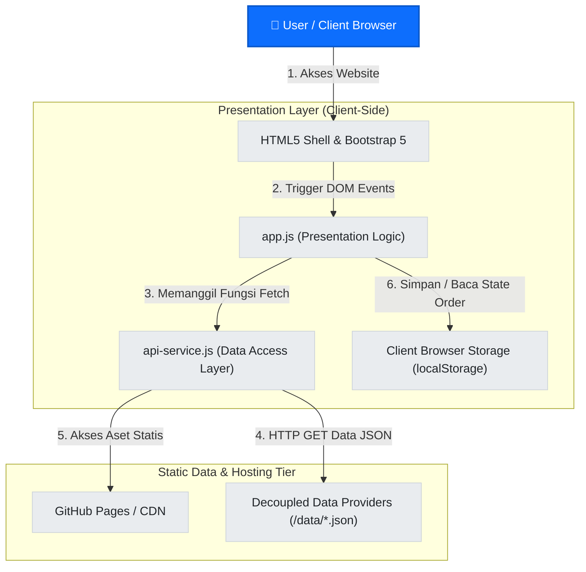

# Tugas Mandiri Praktikum PPW Week 4 - Decoupled Multi-Tier Architecture & Dynamic CSR

Repositori ini berisi pengerjaan Tugas Mandiri Praktikum **Pemrograman dan Pengujian Aplikasi Web (PPW)** Minggu 04, Program Studi S1 Sistem Informasi - Institut Teknologi Del.

## 👤 Identitas Mahasiswa
- **Nama:** Amelia Renata Lumbanbatu
- **Program Studi:** S1 Sistem Informasi (2024)
- **Institusi:** Institut Teknologi Del
- **NIM:** 12S24031
- **LinkedIn:** [Amelia Renata Lumbanbatu](https://www.linkedin.com/in/amelia-renata-lumbanbatu-867936364)
- **Live Demo GitHub Pages:** [https://AmeliaLumbanbatu.github.io/ppw-2026-week2-12S24031/](https://AmeliaLumbanbatu.github.io/ppw-2026-week2-12S24031/)

---

## 🛠️ Implementasi Spesifikasi Modul

1. **Pemodelan Arsitektur Multi-Tier & Diagram C4:** Mendekomposisi aplikasi web menjadi *Presentation Tier*, *Application/API Logic Tier*, dan *Data Storage Tier*, serta memodelkannya ke dalam Diagram C4 Container Model.
2. **Analisis Paradigma Rendering:** Mengidentifikasi perbedaan arsitektural dan *trade-offs* antara Monolith vs Microservices, Server-Side Rendering (SSR), Client-Side Rendering (CSR), dan Jamstack.
3. **Transformasi Proyek Minggu 3 ke Dynamic CSR:** Menghapus konten kartu HTML yang sebelumnya ditulis secara statis (*hardcoded*) dan menggantikannya dengan pemuatan data dinamis menggunakan JavaScript modern (ES6+ `fetch()` dan `async/await`).
4. **Desain Data Provider Modular JSON:** Merancang struktur data mandiri (`projects.json`, `services.json`, `profile.json`) yang bertindak sebagai *decoupled mock RESTful data layer*.
5. **Manajemen Siklus Status Antarmuka (UI States):** Mengimplementasikan penanganan visual status antarmuka komprehensif: *Loading State* (Skeleton/Spinner), *Success Render State*, *Empty State*, dan *Error Fallback Alert*.
6. **Universal Dynamic Modal Component:** Mengonfigurasi satu komponen modal tunggal Bootstrap 5 yang dapat menyajikan rincian proyek secara dinamis berdasarkan `data-ID` tanpa duplikasi elemen HTML.
7. **Decoupled Asynchronous REST Form Dispatching:** Merefaktor formulir layanan Week 3 menjadi mekanisme pengiriman asinkron (AJAX/Fetch POST) dengan serialisasi JSON DTO dan umpan balik visual Toast tanpa memicu *full page reload*.
8. **Manajemen State Lokal Sisi Klien:** Menyimpan riwayat pemesanan layanan ke dalam `localStorage` sebagai lapisan persistensi terdistribusi di sisi klien dan memperbarui *badge order* pada navbar.
9. **Analisis Caching & Profil Kinerja (RFC 9111):** Mengukur *Time to First Byte* (TTFB), *First Contentful Paint* (FCP), hierarki *Waterfall*, dan efisiensi header HTTP Caching (`Cache-Control`, `ETag`, `304 Not Modified`) melalui Browser DevTools.
10. **Keamanan Sisi Klien Lapis Pertama:** Menerapkan sanitasi masukan guna mencegah kerentanan *DOM-based Cross-Site Scripting* (XSS) menggunakan fungsi `escapeHTML()`.

---

## 🏗️ Diagram Arsitektur C4 Container Model
